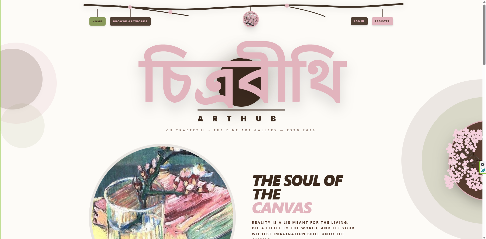

# 🎨 চিত্রবীথি — ArtHub

> A modern digital art marketplace where creativity meets commerce — a living ecosystem for artists, collectors, and art lovers.

[](https://chitrabeethi-client-ten.vercel.app/)

---



---

## 🧭 Project Overview

**চিত্রবীথি — ArtHub** is a full-stack digital art marketplace built to connect artists with buyers through a seamless, role-based platform.

The system enables:
- **Artists** to showcase, manage, and sell their artworks 🖌️  
- **Users** to browse, purchase, and interact with art 🖼️  
- **Admins** to oversee users, artworks, and platform transactions ⚙️  

It transforms traditional gallery-based art discovery into a **global, accessible, and interactive online marketplace**.

---

## 🚀 Live Links

* **Client / Web Application:** [https://chitrabeethi-client.vercel.app](https://chitrabeethi-client-ten.vercel.app)
* **Backend Repository:** [Cheetrabithi Server](https://github.com/NairaMehjabin/cheetrabithi-server)

---

## ✨ Key Features

### 🧑‍🎨 Role-Based System
- Separate dashboards for **User, Artist, and Admin**
- Dynamic navigation based on authentication state

### 🖼️ Art Marketplace
- Browse, search, filter, and sort artworks
- Detailed artwork pages with artist info
- Category-based discovery system

### 💳 Transactions & Payments
- Stripe integration for purchases
- Subscription tiers (Free, Pro, Premium)
- Purchase history tracking

### 🔐 Authentication System
- Email/password login
- Google OAuth (NextAuth)
- Secure session handling

### 💬 Interactive System
- Comment system on artworks (post-purchase gated)
- User-owned comment editing & deletion

### 📊 Admin Control Panel
- Manage users, artworks, and transactions
- View analytics (sales, users, revenue, categories)

### 🎭 UI/UX
- Smooth animations using Framer Motion
- Fully responsive design (mobile → desktop)
- Clean icon system with Lucide React

---

## 🛠️ Tech Stack & Dependencies

### ⚛️ Frontend & UI
* **Framework:** Next.js (App Router), React, TypeScript
* **Styling:** Tailwind CSS
* **Animations:** `framer-motion`
* **Icons:** `lucide-react`

### 🔐 Auth & State
* **Authentication:** NextAuth.js
* **HTTP Client:** Axios / Fetch API

### 🧠 Backend & External Services
* **Runtime:** Node.js & Express.js
* **Database:** MongoDB & Mongoose ORM
* **Payments:** Stripe API
* **Image Hosting:** imgBB API

---

## 💻 Local Setup & Installation Guide

### Prerequisites
Make sure you have Node.js (v18 or higher) and Git installed on your system.

### 1. Clone the Repository
```bash
git clone https://github.com/NairaMehjabin/cheetrabithi.git
cd cheetrabithi
2. Install Dependencies
Bash
npm install
3. Environment Configuration
Create a .env.local file in the root directory of the project and configure your environment variables:

Code snippet
NEXT_PUBLIC_API_URL=http://localhost:5000/api
NEXTAUTH_SECRET=your_nextauth_secret_here
NEXTAUTH_URL=http://localhost:3000
GOOGLE_CLIENT_ID=your_google_client_id
GOOGLE_CLIENT_SECRET=your_google_client_secret
NEXT_PUBLIC_STRIPE_PUBLISHABLE_KEY=your_stripe_publishable_key
4. Run the Development Server
Bash
npm run dev

---

#### 2. Fixed Local Setup for **Cinnabloom Bakery**
```markdown
## 💻 Local Setup & Installation Guide

### Prerequisites
Make sure you have Node.js (v18 or higher) and Git installed on your system.

### 1. Clone the Repository
```bash
git clone https://github.com/NairaMehjabin/cinnabloom-bakery.git
cd cinnabloom-bakery
2. Install Dependencies
Bash
npm install
3. Environment Configuration
Create a .env.local file in the root directory of the project and add your environment variables:

Code snippet
NEXT_PUBLIC_API_URL=http://localhost:5000/api
NEXT_PUBLIC_GOOGLE_CLIENT_ID=your_google_client_id
NEXT_PUBLIC_GOOGLE_CLIENT_SECRET=your_google_client_secret
GEMINI_API_KEY=your_gemini_api_key
4. Run the Development Server
Bash
npm run dev
Open http://localhost:3000 in your browser to view the application!
```

🖤 Closing Note
চিত্রবীথি — ArtHub is not just a project — it is a structured digital ecosystem where art is not just displayed, but experienced, traded, and lived inside.
